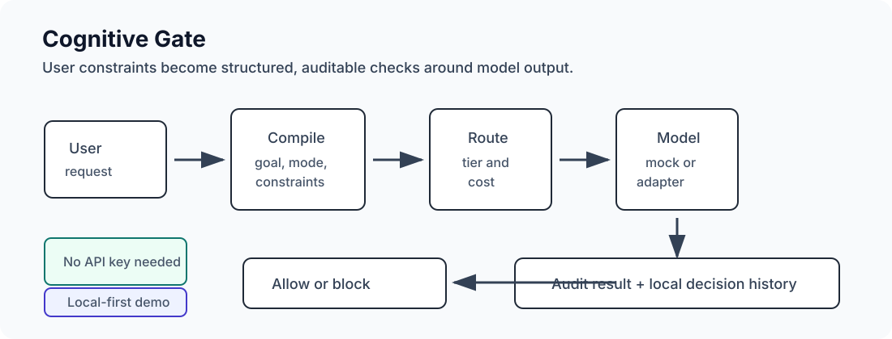

# Cognitive Gate

[](https://github.com/somo-ui/cognitive-gate/actions/workflows/test.yml)
[](https://github.com/somo-ui/cognitive-gate/releases)
[](LICENSE)

Cognitive Gate is a small, installable reference implementation for turning user constraints into structured requests and auditable checks around AI model output.

It is designed for people exploring AI agent guardrails, cross-session constraints, local audit records, and model-agnostic control layers. The repository runs without API keys and uses only the Python standard library at runtime.

中文一句话：Cognitive Gate 把用户说出的限制条件编译成可审计请求，并在模型输出后检查是否违反这些限制。



## Why it exists

Large language models are probabilistic. User boundaries should be observable, repeatable, and testable.

Cognitive Gate demonstrates one practical pattern:

1. Compile a natural-language request into a structured `CognitiveRequest`.
2. Extract user constraints from Chinese or English input.
3. Route the request through a simple task classifier.
4. Generate a mock model response.
5. Audit the response against active or locked constraints.
6. Write local decision records for inspection.

## Install

Requires Python 3.9 or newer. Runtime dependencies: Python standard library only.

Install directly from GitHub:

```bash
python3 -m pip install "git+https://github.com/somo-ui/cognitive-gate.git@v0.1.6"
```

Or install from a local checkout:

```bash
git clone https://github.com/somo-ui/cognitive-gate.git
cd cognitive-gate
python3 -m venv .venv
source .venv/bin/activate
python -m pip install --upgrade pip
python -m pip install .
```

Then run:

```bash
cognitive-gate --demo
cognitive-gate --input "Tidy this room, but don't use the red approach"
cognitive-gate --input "帮我整理房间，但别用红色方案"
```

For development checks:

```bash
python -m unittest discover -s tests -v
```

## Quick examples

Run individual examples from the repository root:

```bash
python examples/01_basic_gate.py
python examples/02_cross_session_constraint.py
python examples/03_local_audit_record.py
```

The default adapter is a deterministic mock model, so the project is inspectable without provider accounts, API keys, or network access.

## Minimal API

```python
from cognitive_gate import CognitiveGateProtocol, ConstraintStore

gate = CognitiveGateProtocol(store=ConstraintStore(":memory:"))
record = gate.decide("Tidy this room, but don't use the red approach")

print(record.final_action)
print(record.audit.get("blocked_reason"))
```

## Architecture

```
User request
   │
   ▼
[Compile]  CompileLayer  →  CognitiveRequest(goal/mode/constraints/risk/reconstructed_text)
   │
   ▼
[Route]    P1Classifier  →  task tier + route
   │
   ▼
[Model]    MockModel / provider adapter
   │
   ▼
[Audit]    AuditLayer    →  output vs active/locked constraints
   │
   ▼
[Record]   decision_record.json + decision_history.jsonl
```

`ConstraintStore` persists JSON locally, so a constraint can be reused across runs. Local files such as `constraints.json`, `decision_record.json`, and `decision_history.jsonl` can be inspected or deleted directly.

## What this is

- A reference implementation for AI agent guardrails.
- A tiny constraint engine for demonstrations and tests.
- A model-agnostic audit pattern that can sit around different model adapters.
- A bilingual example for Chinese and English user constraints.

## What this is not

- It is not a production security boundary.
- It is not an operating-system sandbox.
- It is not a mathematical guarantee that any LLM output is safe.
- It does not claim cross-platform enforcement outside this repository.

The current audit layer is a best-effort guardrail. It is useful for learning, prototyping, and creating reproducible tests, but independent security review is required before production use.

## Project status

Current version: v0.1.6 public reference quality.

- Installable package with `cognitive-gate` CLI.
- Local-only deterministic demo.
- JSON-backed constraint persistence.
- Unit tests for the early gate behavior.
- Community templates for issues and pull requests.

See [CHANGELOG.md](CHANGELOG.md) for release history, [docs/PUBLIC_POSITIONING.md](docs/PUBLIC_POSITIONING.md) for public positioning, [docs/DISTRIBUTION.md](docs/DISTRIBUTION.md) for install and demo channels, [docs/OBSERVABILITY.md](docs/OBSERVABILITY.md) for public traction checks, and [docs/EXTERNAL_DISTRIBUTION_STATUS.md](docs/EXTERNAL_DISTRIBUTION_STATUS.md) for current external publishing state.

## Contributing

Issues and pull requests are welcome. Good contributions include reproducible failure cases, stronger tests, clearer audit records, and provider adapters that keep the control layer separate from model-specific behavior.

Before submitting a pull request:

```bash
python -m unittest discover -s tests -v
python -m pip install .
cognitive-gate --demo
```

## Files

```
cognitive_gate/
  compile_layer.py     turns raw input into CognitiveRequest
  p1_classifier.py     simple task tier classifier
  constraint_store.py  local JSON constraint store
  audit_layer.py       output audit checks
  model_adapter.py     mock/provider adapter boundary
  protocol.py          orchestration layer
demo.py                CLI demo
examples/              runnable examples
tests/test_gate.py     unit tests
```
